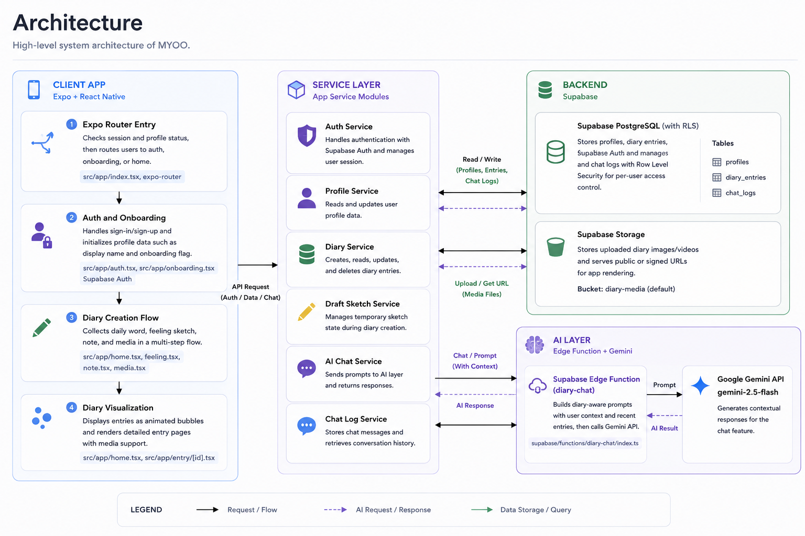
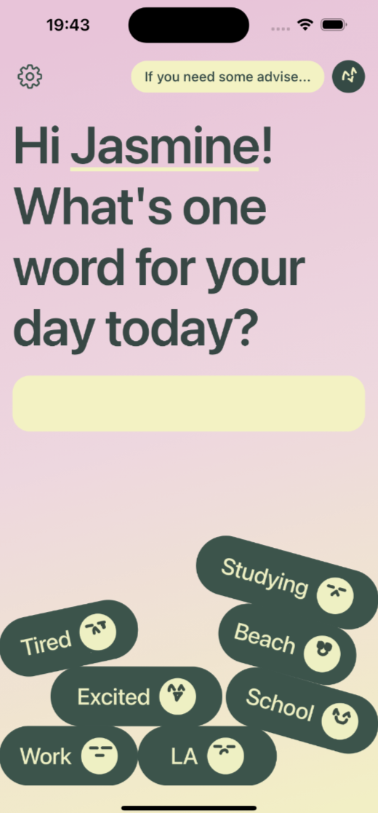
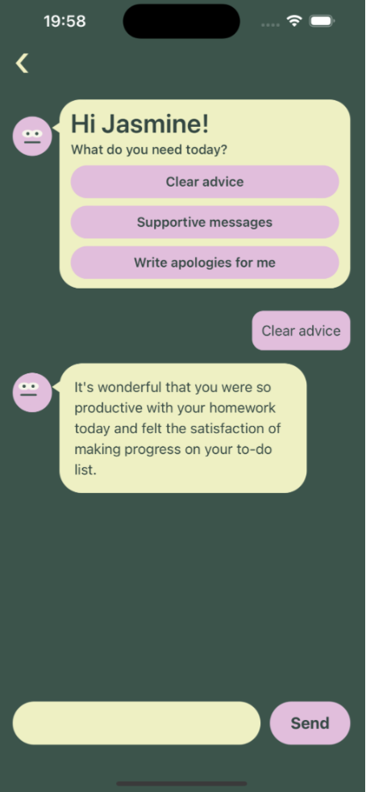
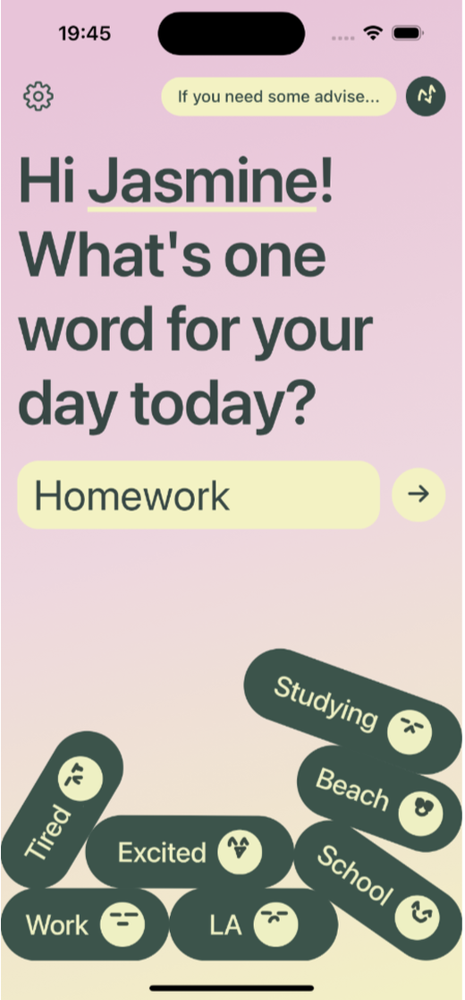
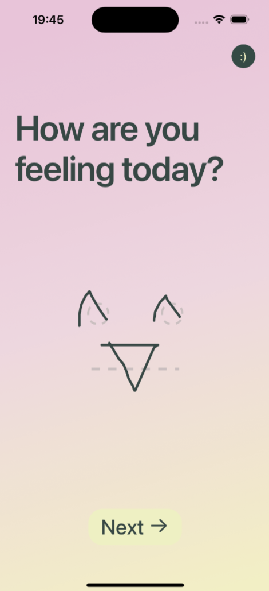
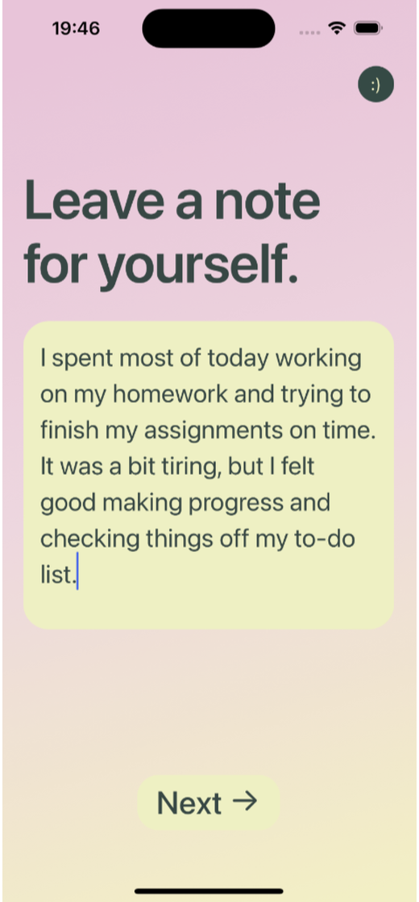
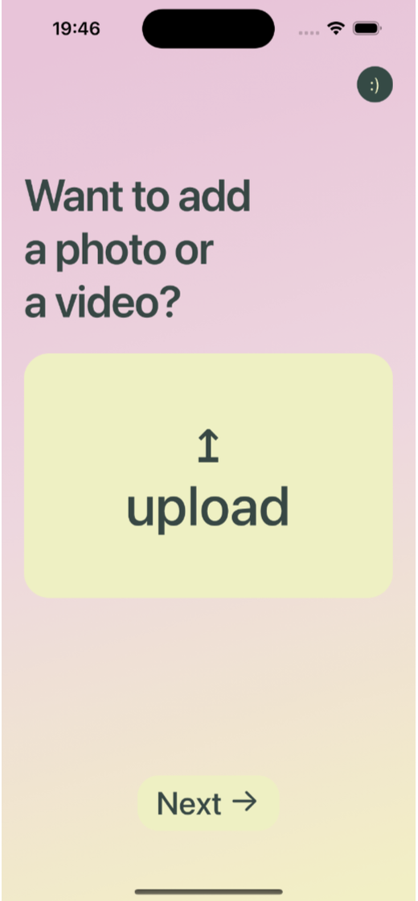

# MYOO

An emotion journaling mobile app where users capture each day with one word, a feeling sketch, notes, and media.


---

## About

MYOO was created to make daily reflection simple and expressive. Instead of writing long diary entries every day, users can record their emotional state with lightweight inputs and revisit memories through visual, textual, and media-based layers.

---

## Features

- Email/password authentication with onboarding flow
- Daily entry flow: word -> feeling sketch -> note -> media
- Animated layer completion experience after saving an entry
- Home bubble view for browsing saved entries
- Entry detail page with media rendering and retry-safe URL handling
- AI chat assistant powered by diary context
- Profile editing, including custom MYOO sketch and password updates

---

## Tech Stack

- Frontend: Expo 56, React Native 0.85, React 19, Expo Router
- Backend: Supabase Auth, Supabase Edge Functions
- Database: Supabase Postgres with Row Level Security
- Cloud: Supabase Storage for image/video uploads

---

## Architecture

The app follows a client-first mobile architecture:

- Expo React Native app handles UI, navigation, and input flows.
- Supabase manages authentication, database access, and storage.
- An Edge Function (`diary-chat`) calls Gemini for contextual AI responses.



---

## Screenshots

### Home



### AI Chat



### Media Upload Flow






---

## Folder Structure

```text
myoo/
├── src/
│   ├── app/          # Route-based screens
│   ├── components/   # Reusable UI components
│   ├── services/     # Supabase and app service layer
│   ├── utils/        # Utility functions
│   └── hooks/        # Custom hooks
├── assets/           # Static assets
├── supabase/         # Schema and Edge Functions
└── PROJECT_DOCUMENTATION.md
```

---

## Installation

1. Install dependencies.

```bash
npm install
```

2. Add environment variables in `.env`.

```bash
EXPO_PUBLIC_SUPABASE_URL=your_supabase_url
EXPO_PUBLIC_SUPABASE_ANON_KEY=your_supabase_anon_key
EXPO_PUBLIC_SUPABASE_MEDIA_BUCKET=diary-media
```

3. Start the Expo development server.

```bash
npm start
```

4. Configure backend resources:
- Apply `supabase/schema.sql`
- Create the media bucket (`diary-media` or your custom bucket)
- Deploy `supabase/functions/diary-chat` and set `GEMINI_API_KEY`

---

## Challenges

- Designing a smooth multi-step journaling flow without overwhelming users
- Handling sketch data consistently across multiple screens
- Managing reliable media access with signed/public URL fallback logic
- Improving AI response quality with minimal but effective diary context

---

## Improvements

- Consolidate duplicated sketch parsing logic into shared utilities
- Expand test coverage for service and route-level flows
- Replace placeholder template routes with product-specific screens
- Add richer analytics and personalized reflection insights
